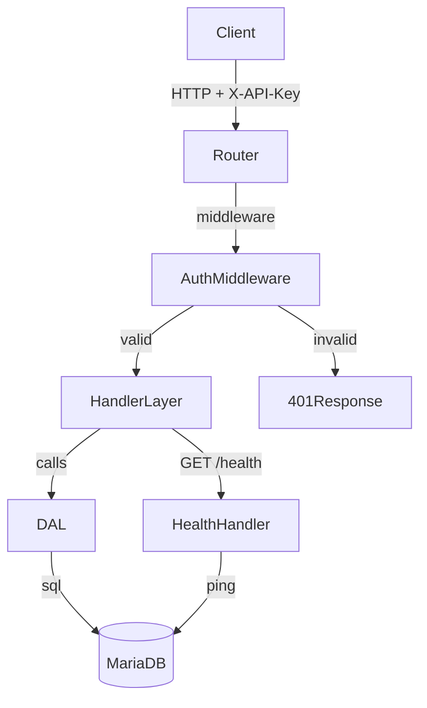

# Design Document: MariaDB DAL API

## Overview

The MariaDB DAL API is a generic HTTP data access layer written in Go. It exposes a RESTful interface for CRUD operations against any table in a MariaDB database, abstracting direct database access from consumers. The API is fully generic — resource names are derived from URL path segments, and all queries are constructed dynamically at runtime.

Key design goals:
- Zero per-resource configuration: any table is accessible via `/{resource}`
- Security-first: parameterized queries, API key auth, resource name validation
- Operational simplicity: environment-variable configuration, structured logging, health check

## Architecture



The server is structured in three layers:

1. **Transport layer** — HTTP router, middleware (auth, logging), request parsing, response serialization
2. **Handler layer** — per-operation handlers that validate input and delegate to the DAL
3. **DAL layer** — pure database interaction: query building, execution, result mapping

### Router Selection

[httprouter](https://github.com/julienschmidt/httprouter) is the most performant Go HTTP router with near-zero allocation routing. It supports named parameters (`/:resource/:id`) and is widely used in production Go services.

### Project Layout

```
cmd/
  server/
    main.go          # entry point: config, DB init, server start
internal/
  config/
    config.go        # env var parsing
  auth/
    middleware.go    # API key middleware
  handler/
    health.go        # GET /health
    resource.go      # CRUD handlers
  dal/
    dal.go           # DB operations
    query.go         # dynamic query builder
  middleware/
    logging.go       # request logging middleware
  model/
    response.go      # shared response types
```

## Components and Interfaces

### Config

Reads all configuration from environment variables at startup.

```go
type Config struct {
    DBHost     string // DB_HOST
    DBPort     string // DB_PORT
    DBName     string // DB_NAME
    DBUser     string // DB_USER
    DBPassword string // DB_PASSWORD
    APIKeys    []string // API_KEYS (comma-separated)
    ListenAddr string // LISTEN_ADDR (default: :8080)
}
```

### Auth Middleware

Reads `X-API-Key` from the request header and checks it against the configured key set. Skips auth for `GET /health`.

```go
func NewAuthMiddleware(keys []string) func(http.Handler) http.Handler
```

### Logging Middleware

Wraps every request to capture method, path, status code, and latency, then emits a structured log line.

```go
func NewLoggingMiddleware() func(http.Handler) http.Handler
```

### DAL Interface

```go
type DAL interface {
    Insert(ctx context.Context, table string, data map[string]any) (map[string]any, error)
    GetByID(ctx context.Context, table string, id string) (map[string]any, error)
    List(ctx context.Context, table string, filters map[string]string, limit, offset int) ([]map[string]any, error)
    Update(ctx context.Context, table string, id string, data map[string]any) (map[string]any, error)
    Patch(ctx context.Context, table string, id string, data map[string]any) (map[string]any, error)
    Delete(ctx context.Context, table string, id string) error
    Ping(ctx context.Context) error
}
```

All methods accept a `table` string that has already been validated by the handler layer.

### Resource Handler

A single handler struct handles all CRUD routes. Route dispatch is done by the router:

```
POST   /{resource}      -> handler.Create
GET    /{resource}      -> handler.List
GET    /{resource}/:id  -> handler.GetByID
PUT    /{resource}/:id  -> handler.Update
PATCH  /{resource}/:id  -> handler.Patch
DELETE /{resource}/:id  -> handler.Delete
```

### Health Handler

```
GET /health -> 200 {"status":"ok"} if DB ping succeeds
            -> 503 {"error":"..."} if DB ping fails
```

## Data Models

### Request / Response

All request bodies are `application/json`. All responses are `application/json`.

**Error response** (all 4xx/5xx):
```json
{ "error": "human-readable message" }
```

**Single record response** (GET by ID, POST, PUT, PATCH):
```json
{ "id": 1, "name": "Alice", ... }
```

**List response** (GET collection):
```json
[
  { "id": 1, "name": "Alice" },
  { "id": 2, "name": "Bob" }
]
```

### Query Parameters

| Parameter | Type    | Default | Description                        |
|-----------|---------|---------|------------------------------------|
| `limit`   | integer | 100     | Max records to return (max 100)    |
| `offset`  | integer | 0       | Number of records to skip          |
| any other | string  | —       | Equality filter on that column     |

### Resource Name Validation

Resource names must match `^[a-zA-Z0-9_]+$`. This is enforced before any query is executed.

### Dynamic Query Building

Queries are built dynamically using `database/sql` placeholders (`?`). Column names from request bodies are used directly as SQL identifiers — they are validated to be safe by the resource name regex (same rule applied to column names from JSON keys).

Example INSERT:
```sql
INSERT INTO `users` (`name`, `email`) VALUES (?, ?) 
```

Example SELECT with filters:
```sql
SELECT * FROM `users` WHERE `status` = ? LIMIT ? OFFSET ?
```

All values are passed as parameters, never interpolated into the query string.

### DB Connection Pool

Configured via `database/sql` with sensible defaults:
- `SetMaxOpenConns(25)`
- `SetMaxIdleConns(5)`
- `SetConnMaxLifetime(5 * time.Minute)`

The `go-sql-driver/mysql` driver is used (compatible with MariaDB).

### Error Mapping

| DB / Go error condition          | HTTP status |
|----------------------------------|-------------|
| Table not found (1146)           | 404         |
| Duplicate key / constraint (1062, 1451, 1452) | 409 |
| Row not found (`sql.ErrNoRows`)  | 404         |
| Invalid JSON body                | 400         |
| Invalid resource/param           | 400         |
| All other errors                 | 500         |


## Correctness Properties

*A property is a characteristic or behavior that should hold true across all valid executions of a system — essentially, a formal statement about what the system should do. Properties serve as the bridge between human-readable specifications and machine-verifiable correctness guarantees.*

### Property 1: Config parsing round-trip

*For any* set of valid environment variable values (host, port, dbname, user, password, API keys), parsing them into a Config struct should produce a struct whose fields exactly match the input values.

**Validates: Requirements 1.1, 2.1**

---

### Property 2: Auth rejects missing or invalid API keys

*For any* HTTP request to a protected endpoint (any endpoint other than `GET /health`), if the `X-API-Key` header is absent or contains a value not in the configured key set, the response status code must be 401.

**Validates: Requirements 2.2, 2.3, 2.4**

---

### Property 3: Health endpoint is exempt from authentication

*For any* call to `GET /health` regardless of whether `X-API-Key` is present or valid, the response must not be 401.

**Validates: Requirements 2.5**

---

### Property 4: Invalid JSON body yields 400

*For any* request to a write endpoint (POST, PUT, PATCH) with a body that is not valid JSON, the response status code must be 400 and the response body must be a JSON object containing an `error` field.

**Validates: Requirements 3.2, 6.4**

---

### Property 5: Unknown resource yields 404

*For any* request (any method) targeting a resource name that does not correspond to an existing table, the response status code must be 404.

**Validates: Requirements 3.4, 4.3, 5.6**

---

### Property 6: Missing record yields 404

*For any* GET, PUT, PATCH, or DELETE request targeting an `id` that does not exist in the table, the response status code must be 404.

**Validates: Requirements 4.2, 6.3, 7.2**

---

### Property 7: Insert round-trip

*For any* valid table and any valid JSON object body, performing `POST /{resource}` followed by `GET /{resource}/{id}` (using the `id` from the POST response) must return a record whose fields match the originally posted data.

**Validates: Requirements 3.1, 4.1**

---

### Property 8: List filter correctness

*For any* table and any set of equality filter query parameters, every record in the response array must satisfy all applied filters. When no records match, the response must be an empty JSON array with status 200.

**Validates: Requirements 5.1, 5.2, 5.3**

---

### Property 9: Limit invariant

*For any* list request with a `limit` parameter L (where 0 < L ≤ 100), the number of records returned must be less than or equal to L. When no `limit` is specified, the number of records returned must be less than or equal to 100.

**Validates: Requirements 5.4**

---

### Property 10: Offset pagination consistency

*For any* table with N records and any valid offset O, the records returned by `GET /{resource}?offset=O` must be identical to records at positions O through O+limit in the full unfiltered result set.

**Validates: Requirements 5.5**

---

### Property 11: PUT round-trip

*For any* existing record and any valid replacement JSON body, performing `PUT /{resource}/{id}` followed by `GET /{resource}/{id}` must return a record whose fields match the PUT body.

**Validates: Requirements 6.1**

---

### Property 12: PATCH partial update preserves unmodified fields

*For any* existing record and any partial JSON body (a strict subset of the record's fields), performing `PATCH /{resource}/{id}` must update only the specified fields; all other fields must retain their original values.

**Validates: Requirements 6.2**

---

### Property 13: Delete round-trip

*For any* existing record, performing `DELETE /{resource}/{id}` must return 204, and a subsequent `GET /{resource}/{id}` must return 404.

**Validates: Requirements 7.1, 7.2**

---

### Property 14: Error responses are well-formed JSON

*For any* request that produces a 4xx or 5xx response, the response body must be valid JSON containing at least an `error` key with a non-empty string value.

**Validates: Requirements 8.1**

---

### Property 15: Resource name validation rejects invalid characters

*For any* resource name containing characters outside `[a-zA-Z0-9_]`, the response status code must be 400 before any database query is executed.

**Validates: Requirements 9.2**

---

### Property 16: Limit and offset validation rejects invalid values

*For any* request where `limit` or `offset` is a negative integer or a non-integer string, the response status code must be 400 before any database query is executed.

**Validates: Requirements 9.3**

---

## Error Handling

All errors are returned as `application/json` with the shape `{"error": "message"}`.

### Error Classification

**Client errors (4xx):**
- `400 Bad Request` — invalid JSON body, invalid resource name, invalid limit/offset
- `401 Unauthorized` — missing or invalid `X-API-Key`
- `404 Not Found` — table does not exist, record not found
- `409 Conflict` — DB constraint violation (duplicate key, FK violation)

**Server errors (5xx):**
- `503 Service Unavailable` — DB unreachable during health check
- `500 Internal Server Error` — any unhandled error; full details logged server-side, generic message returned to client

### MariaDB Error Code Mapping

```go
// MySQL/MariaDB error numbers
const (
    ErrTableNotFound   = 1146 // Table doesn't exist
    ErrDuplicateKey    = 1062 // Duplicate entry
    ErrFKConstraint    = 1451 // FK parent row constraint
    ErrFKChildRow      = 1452 // FK child row constraint
)
```

The DAL layer inspects `*mysql.MySQLError` and maps known error numbers to appropriate HTTP status codes. Unknown errors bubble up as 500.

### Startup Failure

If the DB connection pool cannot be established (ping fails after initialization), the process logs the error and calls `os.Exit(1)`.

## Testing Strategy

### Dual Testing Approach

Both unit tests and property-based tests are required. They are complementary:
- Unit tests cover specific examples, integration points, and error conditions
- Property tests verify universal correctness across randomized inputs

### Property-Based Testing

**Library**: [`pgregory.net/rapid`](https://github.com/flyingmutant/rapid) — a Go property-based testing library with built-in generators and shrinking support.

Each property test must run a minimum of **100 iterations**.

Each test must include a comment tag in the format:
```
// Feature: mariadb-dal-api, Property N: <property text>
```

**Property test mapping:**

| Property | Test description |
|----------|-----------------|
| P1 | Generate random valid env var maps, parse config, assert field equality |
| P2 | Generate random endpoints + random/missing API keys, assert 401 for all invalid cases |
| P3 | Call GET /health with any/no API key, assert response != 401 |
| P4 | Generate random invalid JSON strings, POST/PUT/PATCH, assert 400 + error field |
| P5 | Generate random non-existent table names (valid chars), any method, assert 404 |
| P6 | Generate random non-existent IDs, GET/PUT/PATCH/DELETE, assert 404 |
| P7 | Generate random record data, POST then GET by returned ID, assert field equality |
| P8 | Generate random records + filter params, list with filter, assert all results match filter |
| P9 | Generate random limit values, list, assert len(results) <= limit |
| P10 | Generate random offset values, list with offset, assert records match expected slice |
| P11 | Generate existing record + new data, PUT then GET, assert field equality |
| P12 | Generate existing record + partial update, PATCH then GET, assert only patched fields changed |
| P13 | Generate existing record, DELETE then GET, assert 204 then 404 |
| P14 | Generate any error-producing request, assert response is valid JSON with error field |
| P15 | Generate resource names with invalid chars, any request, assert 400 |
| P16 | Generate negative/non-integer limit or offset, list request, assert 400 |

### Unit Tests

Unit tests focus on:
- Config parsing edge cases (missing required vars, empty API key list)
- DB error code mapping (each MySQL error number maps to correct HTTP status)
- Query builder output for each operation (INSERT, SELECT, UPDATE, DELETE)
- Health check handler with mocked DB (up and down states)
- Auth middleware with exact key matching
- Request logging middleware captures correct fields

### Integration Tests

Integration tests (using a real MariaDB instance via Docker or testcontainers-go) cover:
- Full CRUD lifecycle on a real table
- Constraint violation scenarios (duplicate key, FK)
- Connection pool behavior under load
- Startup failure with bad credentials
